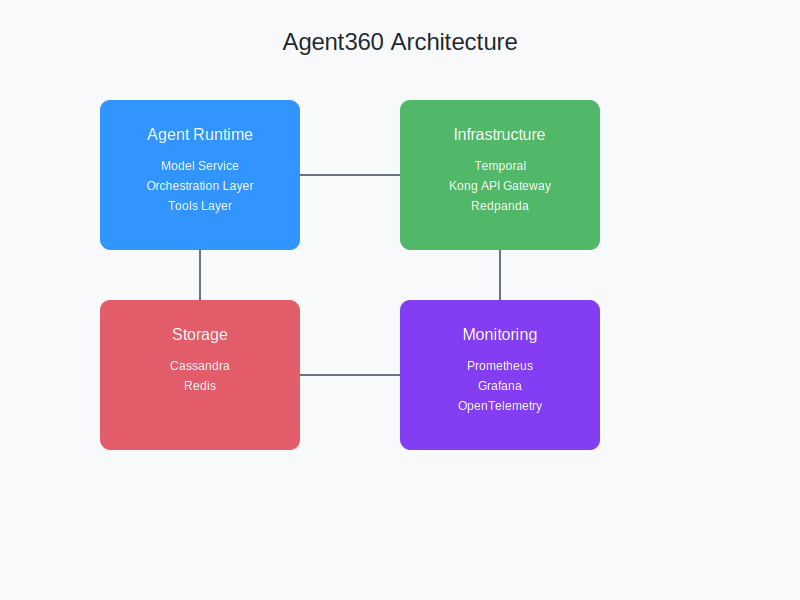

# Agent360 - Enterprise-Grade Agent Infrastructure

## Overview
Agent360 is a scalable, reliable, and observable infrastructure for deploying AI agents in an enterprise environment. It leverages modern technologies including Kubernetes, Temporal, Kong, Redpanda, Cassandra, and Redis.

<div align="center">
  
</div>

## Key Components
- Agent Runtime (Model Service, Orchestration Layer, Tools Layer)
- Infrastructure Components (Temporal, Kong, Redpanda, Cassandra, Redis)

## Getting Started

### Prerequisites
- Python 3.9-3.12
- Docker and Docker Compose
- Kubernetes cluster (for production deployment)

### Installation
1. Clone the repository
2. Create a virtual environment:
   ```bash
   python -m venv venv
   source venv/bin/activate  # On Windows: venv\Scripts\activate
   ```
3. Install dependencies:
   ```bash
   pip install -r requirements.txt
   ```

### Configuration
1. Copy `.env.example` to `.env`
2. Update environment variables as needed

#### Environment Variables
The application uses Pydantic's settings management with the following prefixes:
- `AGENT360_` - Core application settings
- `AUTH_` - Authentication settings

Example configuration:
```python
# Core Settings (AGENT360_ prefix)
AGENT360_CASSANDRA_HOSTS=["localhost"]
AGENT360_CASSANDRA_PORT=9042
AGENT360_REDIS_HOST=localhost
AGENT360_REDIS_PORT=6379

# Auth Settings (AUTH_ prefix)
AUTH_SECRET_KEY=your-secret-key
AUTH_ACCESS_TOKEN_EXPIRE_MINUTES=30
```

All settings are case-insensitive and can be configured via:
1. Environment variables
2. `.env` file
3. Default values in code

## Development
- `src/agent_runtime/` - Core agent implementation
- `src/infrastructure/` - Infrastructure components
- `src/tools/` - Tool implementations
- `src/api/` - API endpoints
- `k8s/` - Kubernetes manifests

## Testing
```bash
# Run tests with specific Python version
pytest tests/

# Run tests with coverage
pytest tests/ --cov=src/ --cov-report=html
```

## Documentation
Refer to the `docs/` directory for detailed documentation:
- Architecture Guide
- API Documentation
- Development Guide
- Operations Manual
