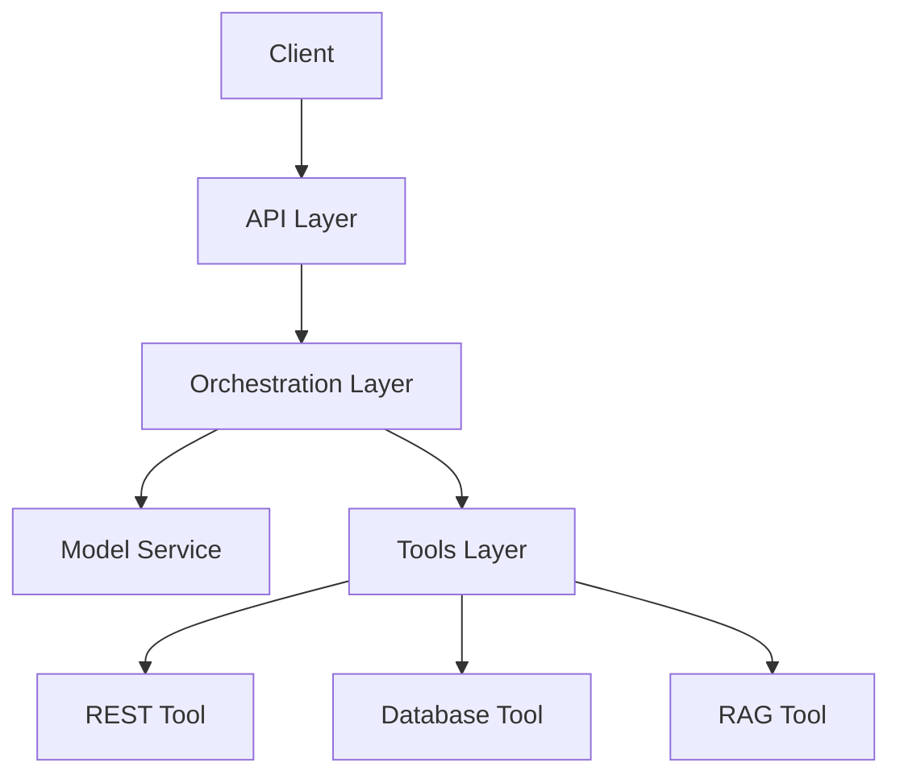

# Agent360 Architecture Guide

## System Overview

Agent360 is an enterprise-grade agent infrastructure designed for scalability, reliability, and observability. This document outlines the system's architecture and key components.

### Core Components

#### 1. Agent Runtime
- **Model Service**: Manages LLM interactions with support for multiple providers
- **Orchestration Layer**: Implements ReAct framework and chain-of-thought processing
- **Tools Layer**: Extensible framework for tool integration

#### 2. Infrastructure Components
- **Temporal**: Workflow engine for task orchestration
- **Kong**: API Gateway for request routing and security
- **Redpanda**: Event streaming platform
- **Cassandra**: Distributed database
- **Redis**: In-memory cache

### System Design

#### Data Flow
1. Requests enter through Kong API Gateway
2. API layer validates and routes requests
3. Orchestration layer manages execution flow
4. Tools execute specific functions
5. Results are processed and returned

#### Scalability
- Horizontal scaling via Kubernetes
- Connection pooling for databases
- Caching layer for performance
- Event-driven architecture

#### Reliability
- Automatic failover
- Retry mechanisms
- Circuit breakers
- Error recovery

#### Security
- OAuth2 authentication
- Role-based access control
- Data encryption
- Audit logging

### Monitoring & Observability

#### Metrics
- Prometheus metrics collection
- Custom business metrics
- SLA monitoring
- Resource utilization

#### Logging
- Structured JSON logging
- Correlation IDs
- Log aggregation
- Error tracking

#### Tracing
- Distributed tracing
- Request tracking
- Performance profiling
- Bottleneck identification
