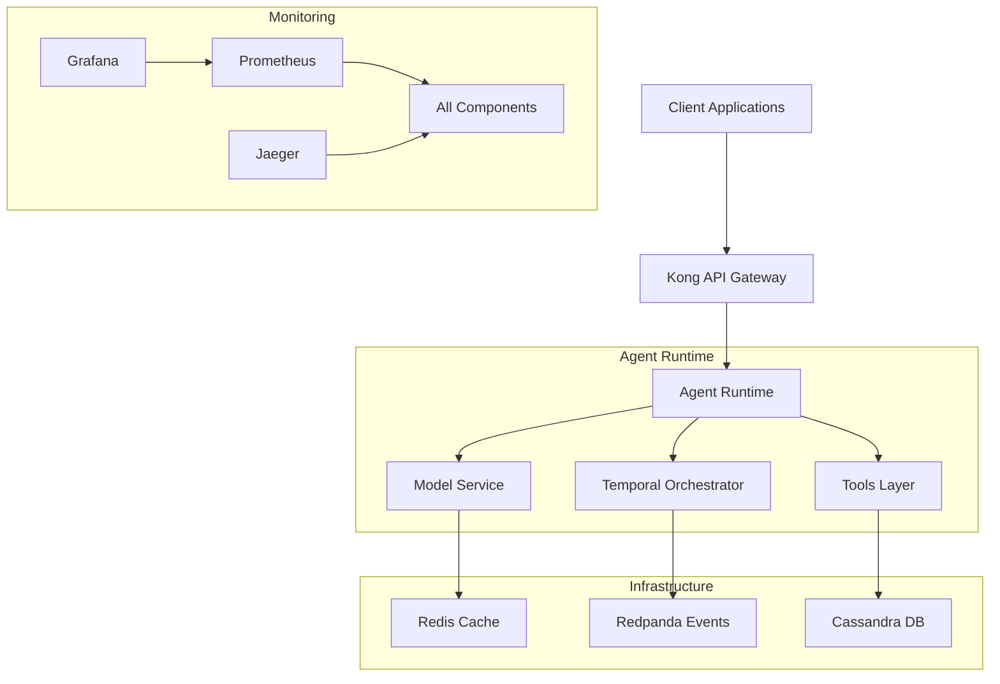
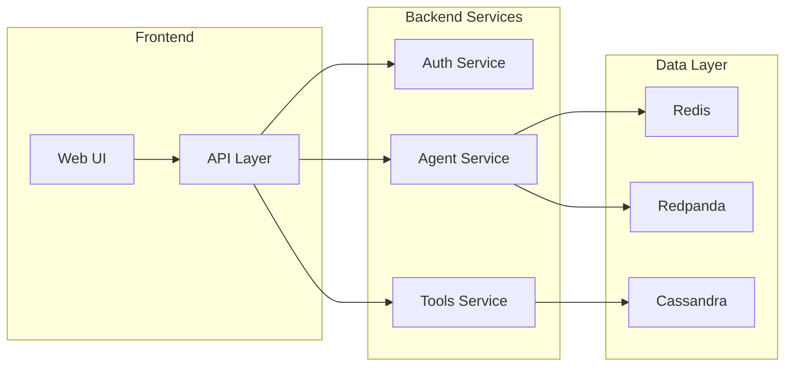
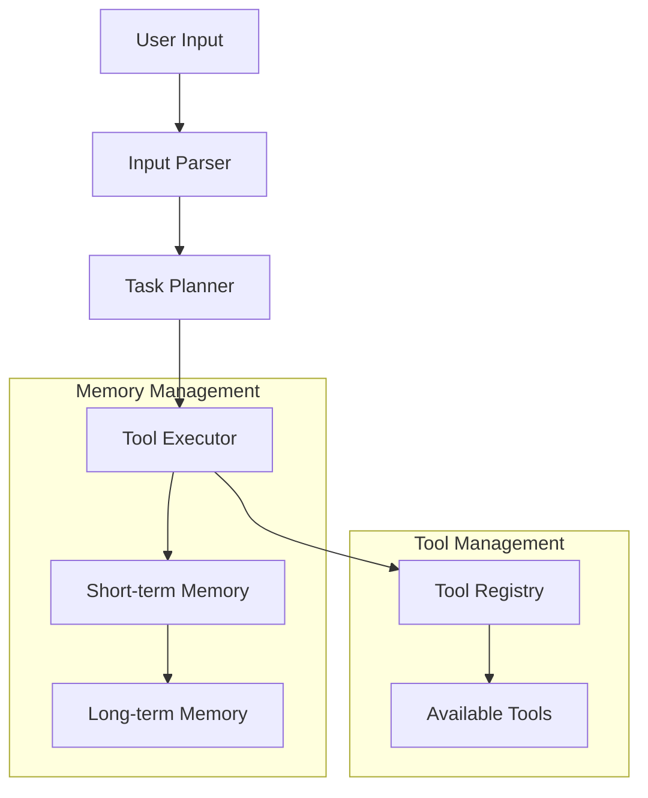
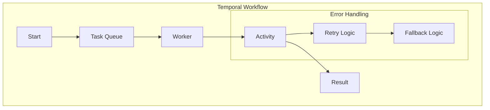
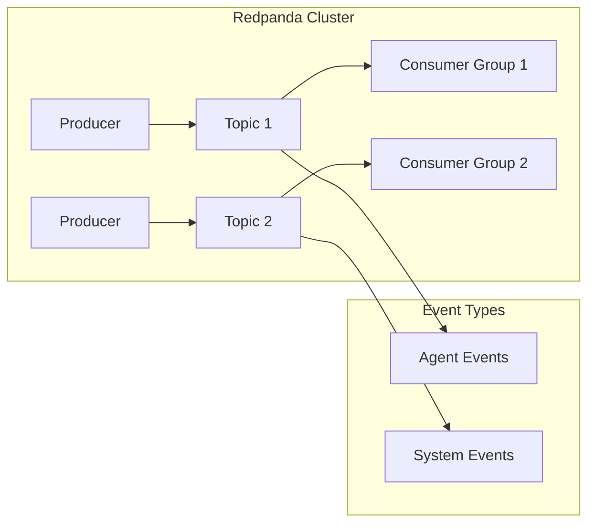
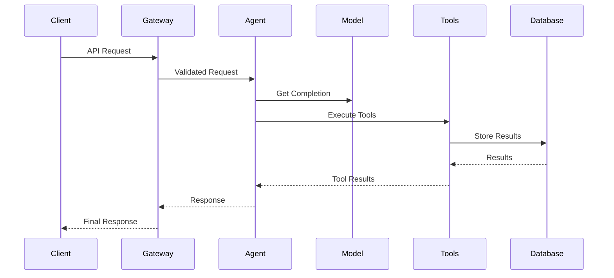
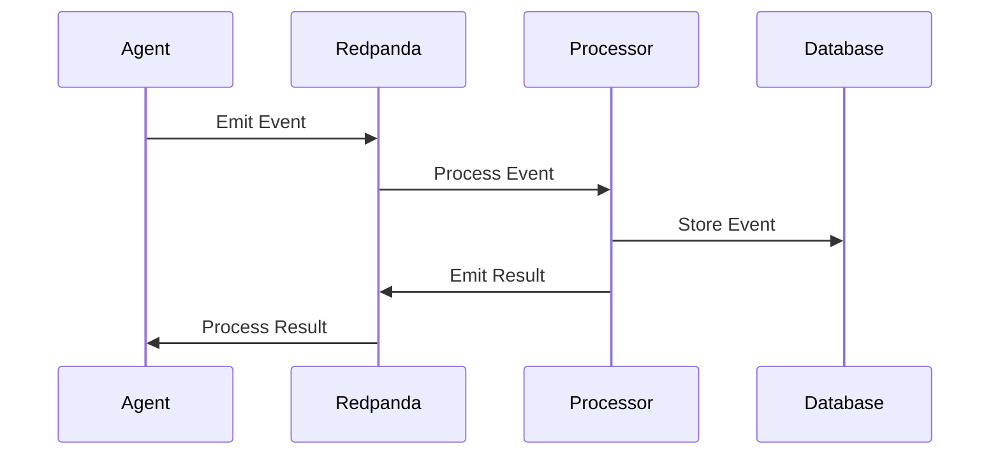
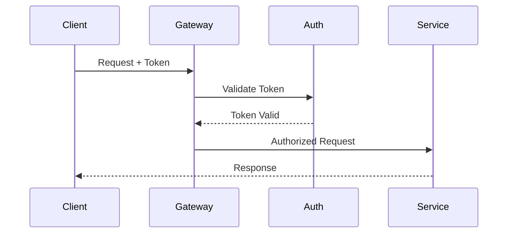

# Agent360 Architecture Documentation

## Table of Contents
1. [System Overview](#system-overview)
2. [Core Components](#core-components)
3. [Infrastructure Components](#infrastructure-components)
4. [Data Flow](#data-flow)
5. [Integration Points](#integration-points)
6. [Security Architecture](#security-architecture)

## System Overview

### High-Level Architecture


### System Components


## Core Components

### Agent Runtime Architecture


### Model Service Architecture
```yaml
# Model Service Component Diagram
components:
  model_service:
    type: service
    components:
      - name: Model Router
        description: Routes requests to appropriate models
        interfaces:
          - gpt4
          - claude
          - local_models
      
      - name: Model Cache
        description: Caches model responses
        technology: Redis
      
      - name: Batch Processor
        description: Handles batch inference requests
        scaling:
          min_replicas: 2
          max_replicas: 10
      
      - name: Performance Monitor
        description: Monitors model performance
        metrics:
          - latency
          - throughput
          - error_rate
```

### Orchestration Layer


## Infrastructure Components

### API Gateway Architecture
```yaml
# Kong Gateway Configuration
gateway:
  routes:
    - name: agent_api
      paths: ["/api/v1/agent"]
      methods: [GET, POST]
      plugins:
        - name: rate-limiting
          config:
            minute: 60
        - name: jwt
        - name: cors
    
    - name: tools_api
      paths: ["/api/v1/tools"]
      methods: [GET, POST]
      plugins:
        - name: oauth2
        - name: acl
```

### Event Streaming Architecture


### Database Architecture
```yaml
# Cassandra Cluster Configuration
cassandra:
  topology:
    datacenters:
      - name: dc1
        racks:
          - name: rack1
            nodes: 3
      - name: dc2
        racks:
          - name: rack1
            nodes: 3
  
  replication:
    class: NetworkTopologyStrategy
    dc1: 3
    dc2: 3
```

## Data Flow

### Request Flow


### Event Flow


## Integration Points

### External Service Integration
```mermaid
graph TB
    Agent[Agent360] --> Auth[Auth Service]
    Agent --> Storage[Storage Service]
    Agent --> Analytics[Analytics Service]
    
    subgraph "Authentication"
        Auth --> OAuth[OAuth Provider]
        Auth --> LDAP[LDAP]
    end
    
    subgraph "Storage"
        Storage --> S3[AWS S3]
        Storage --> Azure[Azure Blob]
    end
```

### Tool Integration
```yaml
# Tool Integration Architecture
tools:
  categories:
    - name: REST Tools
      interface: RESTInterface
      auth: OAuth2
      rate_limit: 100/minute
    
    - name: Database Tools
      interface: DatabaseInterface
      connection_pool: true
      max_connections: 50
    
    - name: File Tools
      interface: FileInterface
      storage: S3
```

## Security Architecture

### Authentication Flow


### Authorization Model
```yaml
# RBAC Configuration
roles:
  - name: admin
    permissions:
      - all
  
  - name: developer
    permissions:
      - read:*
      - write:tools
      - execute:tools
  
  - name: viewer
    permissions:
      - read:*
```

## Best Practices

### 1. Component Design
- Follow microservices principles
- Implement circuit breakers
- Use health checks
- Enable monitoring

### 2. Data Management
- Implement data partitioning
- Use connection pooling
- Configure caching
- Handle backups

### 3. Security
- Implement authentication
- Use authorization
- Enable encryption
- Regular audits

### 4. Scalability
- Horizontal scaling
- Load balancing
- Resource optimization
- Performance monitoring
