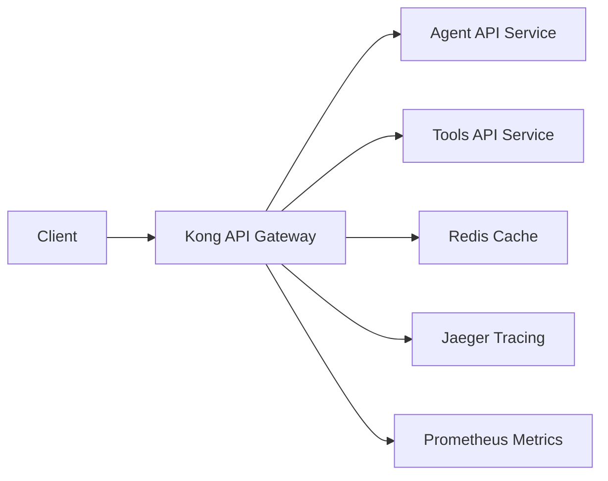

# Kong API Gateway Integration

## Overview
Agent360 uses Kong API Gateway as the primary entry point for all API traffic. Kong provides essential features for security, traffic management, monitoring, and API governance.

## Architecture

### High-Level Design


### Components
- **Kong Proxy**: Handles all incoming API traffic (ports 8000/8443)
- **Kong Admin**: Internal API for configuration (ports 8001/8444)
- **Kong Metrics**: Prometheus metrics endpoint (port 8100)

## Features

### Authentication & Authorization
1. **JWT Authentication**
   - Used for Agent API endpoints
   - Configuration:
     ```yaml
     jwt:
       key_claim_name: kid
       claims_to_verify:
         - exp
       maximum_expiration: 3600
     ```
   - Token format: `Authorization: Bearer <jwt_token>`

2. **OAuth2**
   - Used for Tools API endpoints
   - Supported flows:
     - Authorization Code
     - Client Credentials
   - Scopes:
     - `tools:read`
     - `tools:write`

### Traffic Management
1. **Rate Limiting**
   - Agent API: 60 requests/minute
   - Tools API: 30 requests/minute
   - Redis-based distributed rate limiting
   - Headers:
     - `X-RateLimit-Limit`
     - `X-RateLimit-Remaining`
     - `X-RateLimit-Reset`

2. **Circuit Breaker**
   - Timeout: 10 seconds
   - Max failures: 5
   - Reset timeout: 60 seconds
   - Prevents cascade failures

### Observability
1. **Metrics**
   - Prometheus endpoint: `:8100/metrics`
   - Metrics collected:
     - Request counts
     - Latency
     - Status codes
     - Upstream health

2. **Tracing**
   - Zipkin/Jaeger integration
   - Sampling rate: 100%
   - Trace context propagation
   - Endpoint: `http://jaeger-collector:9411`

3. **Logging**
   - Access logs: stdout
   - Error logs: stderr
   - Correlation IDs
   - Request/Response logging

## Deployment

### Kubernetes
```bash
# Apply Kong configurations
kubectl apply -f k8s/base/kong/

# Verify deployment
kubectl get pods -l app=kong
kubectl get svc kong-proxy
```

### Helm
```bash
# Install/upgrade Kong
helm upgrade --install agent360 ./helm/agent360 --values ./helm/agent360/values.yaml

# Check status
helm status agent360
```

## Configuration

### Environment Variables
```yaml
KONG_DATABASE: "off"
KONG_DECLARATIVE_CONFIG: /kong/config/kong.yaml
KONG_PROXY_LISTEN: "0.0.0.0:8000, 0.0.0.0:8443 ssl"
KONG_ADMIN_LISTEN: "0.0.0.0:8001"
```

### Resource Requirements
```yaml
resources:
  limits:
    cpu: "2"
    memory: "2Gi"
  requests:
    cpu: "500m"
    memory: "1Gi"
```

## Security Best Practices

1. **API Security**
   - Enable JWT/OAuth2 authentication
   - Use HTTPS for all endpoints
   - Implement rate limiting
   - Enable bot detection

2. **Network Security**
   - Restrict admin API access
   - Use network policies
   - Enable IP restrictions
   - Configure CORS properly

3. **Monitoring & Alerts**
   - Monitor error rates
   - Track latency metrics
   - Set up alerts for circuit breaker events
   - Monitor rate limit violations

## Troubleshooting

### Common Issues

1. **Rate Limiting**
   ```bash
   # Check Redis connection
   kubectl exec -it <kong-pod> -- redis-cli -h redis ping
   
   # View rate limit counters
   kubectl exec -it <kong-pod> -- redis-cli -h redis keys *rate-limiting*
   ```

2. **Authentication**
   ```bash
   # Test JWT token
   curl -i -H "Authorization: Bearer <token>" http://kong-proxy/api/v1/agent
   
   # Check OAuth2 token
   curl -i -H "Authorization: Bearer <token>" http://kong-proxy/api/v1/tools
   ```

3. **Circuit Breaker**
   ```bash
   # Check upstream health
   kubectl exec -it <kong-pod> -- curl -i localhost:8001/upstreams
   ```

### Logs
```bash
# View Kong access logs
kubectl logs -f <kong-pod> -c kong

# View Kong error logs
kubectl logs -f <kong-pod> -c kong
```

## Maintenance

### Upgrades
1. Update Kong version in values.yaml
2. Apply changes:
   ```bash
   helm upgrade agent360 ./helm/agent360 --values ./helm/agent360/values.yaml
   ```

### Backup & Restore
- Kong uses declarative configuration
- Backup kong.yaml ConfigMap:
  ```bash
  kubectl get configmap kong-config -o yaml > kong-config-backup.yaml
  ```

## Monitoring & Alerts

### Prometheus Rules
```yaml
- alert: KongHighErrorRate
  expr: sum(rate(kong_http_requests_total{status=~"5.."}[5m])) / sum(rate(kong_http_requests_total[5m])) > 0.05
  for: 5m
  labels:
    severity: critical
  annotations:
    description: "Kong error rate is above 5% for 5 minutes"

- alert: KongHighLatency
  expr: histogram_quantile(0.95, sum(rate(kong_latency_bucket[5m])) by (le)) > 1000
  for: 5m
  labels:
    severity: warning
  annotations:
    description: "95th percentile latency is above 1s for 5 minutes"
```

## API Documentation

### Headers
All requests should include:
```
X-Request-ID: <uuid>
Authorization: Bearer <token>
Content-Type: application/json
```

### Response Headers
```
X-Kong-Response-Time: <ms>
X-Kong-Upstream-Latency: <ms>
X-Kong-Proxy-Latency: <ms>
```

### Rate Limit Headers
```
X-RateLimit-Limit: <requests_per_window>
X-RateLimit-Remaining: <remaining_requests>
X-RateLimit-Reset: <seconds_until_reset>
```
